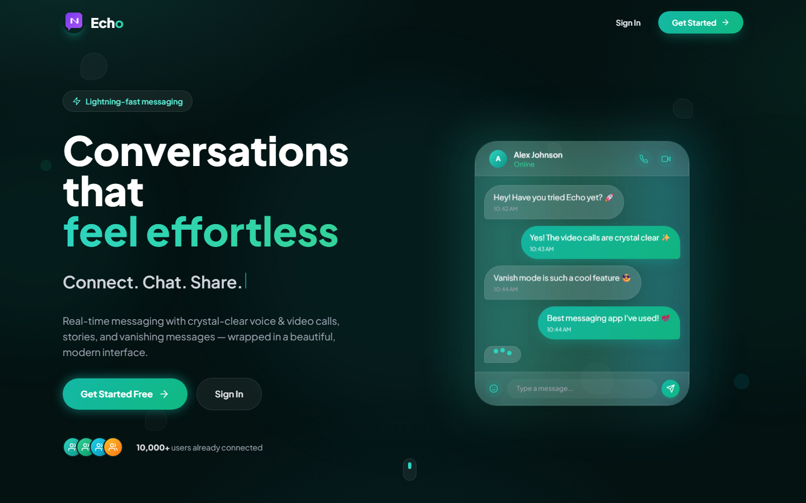
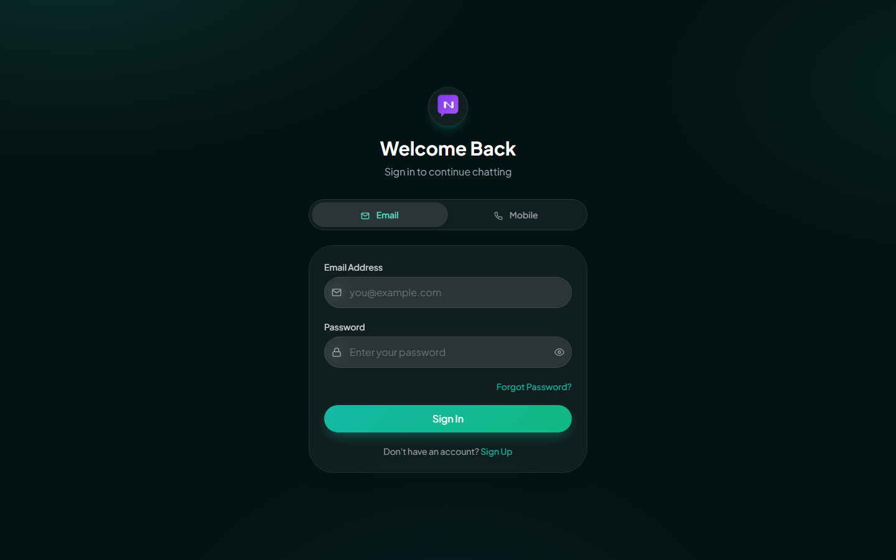

# 💬 Mahaa Verse - Real-Time Full Stack Messenger

A **production-ready** real-time chat application built with the **MERN Stack** (MongoDB, Express.js, React.js, Node.js) and **Socket.IO**. Features end-to-end messaging, user authentication, file sharing, and a modern responsive UI with dark/light theme support.


---

## 📸 Screenshots

| Landing Page | Sign In |
|--------------|---------|
|  |  |

---

## 🚀 Features

### ✅ Completed Features

#### Authentication
- [x] Sign up / Login with Email & Password
- [x] Login with Mobile Number using OTP verification
- [x] Forgot Password via Email
- [x] Email Verification after registration
- [x] JWT Authentication with HTTP-only cookies
- [x] bcrypt password hashing (12 salt rounds)
- [x] Logout from all devices
- [x] Update password

#### Real-time Messaging
- [x] One-to-One messaging using Socket.IO
- [x] Group chats (create groups, manage members, group info)
- [x] Online / Offline status with real-time updates
- [x] Typing indicator
- [x] Message read receipts (✓, ✓✓)
- [x] Seen by (who has read your messages)
- [x] Message delivered status
- [x] Instant message delivery

#### Voice & Video Calls
- [x] Voice calls (WebRTC)
- [x] Video calls (WebRTC)
- [x] Ringing, accept, reject & end calls
- [x] Mute microphone during calls
- [x] Toggle camera on/off
- [x] Call duration timer

#### Stories
- [x] Text, image & video stories
- [x] 24-hour auto-expiry
- [x] Story viewer tracking
- [x] Create & delete stories

#### File Sharing
- [x] Image sharing with preview
- [x] Video sharing with player
- [x] Audio messages with player
- [x] Document & file sharing
- [x] Cloudinary integration for file storage
- [x] 10MB file size limit

#### Message Features
- [x] Edit sent messages
- [x] Delete messages (for self)
- [x] Reply to messages
- [x] Message search
- [x] Message reactions (emoji)
- [x] Forward messages to other chats
- [x] Vanish mode (messages auto-delete after 5m / 1h / 24h / 7d)
- [x] Chat history stored in MongoDB

#### User Features
- [x] User profile (Photo, Bio, Status)
- [x] Profile picture upload
- [x] Block / Unblock users
- [x] Pin important chats
- [x] Recent chats list
- [x] Unread message count
- [x] Last seen tracking
- [x] Desktop notifications with preferences

#### UI/UX
- [x] Responsive design (mobile-first)
- [x] Dark & Light theme with toggle
- [x] Loading skeletons
- [x] Toast notifications
- [x] Emoji picker
- [x] Form validation
- [x] Error handling
- [x] Modern UI (inspired by WhatsApp/Telegram)

#### Security
- [x] HTTP-only cookies for JWT
- [x] Password hashing with bcrypt
- [x] Input validation & sanitization
- [x] XSS protection
- [x] CORS configuration

---

## 📁 Folder Structure

```
backend/
│   ├── config/
│   │   ├── db.js              # MongoDB connection
│   │   ├── socket.js           # Socket.IO configuration
│   │   └── cloudinary.js       # Cloudinary setup
│   ├── controllers/
│   │   ├── authController.js   # Auth operations
│   │   ├── userController.js   # User profile operations
│   │   ├── chatController.js   # Chat management
│   │   ├── messageController.js# Message operations
│   │   └── storyController.js  # Story operations
│   ├── middlewares/
│   │   ├── auth.js             # JWT authentication middleware
│   │   ├── error.js            # Global error handler
│   │   └── upload.js           # File upload middleware
│   ├── models/
│   │   ├── User.js             # User model
│   │   ├── Chat.js             # Chat model
│   │   ├── Message.js          # Message model
│   │   ├── Story.js            # Story model
│   │   └── OTP.js              # OTP model
│   ├── routes/
│   │   ├── authRoutes.js       # Auth API routes
│   │   ├── userRoutes.js       # User API routes
│   │   ├── chatRoutes.js       # Chat API routes
│   │   ├── messageRoutes.js    # Message API routes
│   │   └── storyRoutes.js      # Story API routes
│   ├── utils/
│   │   ├── generateToken.js    # JWT token utility
│   │   ├── sendEmail.js        # Email sending utility
│   │   └── helpers.js          # Helper functions
│   ├── uploads/                # Local uploads fallback
│   ├── .env                    # Environment variables
│   ├── server.js               # Entry point
│   └── package.json
├── frontend/
│   ├── public/
│   ├── src/
│   │   ├── components/
│   │   │   ├── Auth/
│   │   │   │   ├── Login.jsx
│   │   │   │   ├── Signup.jsx
│   │   │   │   └── ForgotPassword.jsx
│   │   │   ├── Chat/
│   │   │   │   ├── ChatSidebar.jsx
│   │   │   │   ├── ChatWindow.jsx
│   │   │   │   ├── MessageList.jsx
│   │   │   │   ├── MessageInput.jsx
│   │   │   │   ├── MessageBubble.jsx
│   │   │   │   ├── MessageSearch.jsx
│   │   │   │   ├── CallModal.jsx
│   │   │   │   ├── StoryBar.jsx
│   │   │   │   ├── CreateGroupModal.jsx
│   │   │   │   ├── GroupInfoPanel.jsx
│   │   │   │   ├── ForwardModal.jsx
│   │   │   │   ├── SeenByModal.jsx
│   │   │   │   ├── VanishModeToggle.jsx
│   │   │   │   └── VoiceRecorder.jsx
│   │   │   ├── Layout/
│   │   │   │   └── ProtectedRoute.jsx
│   │   │   └── common/
│   │   │       ├── ThemeToggle.jsx
│   │   │       ├── EmojiPicker.jsx
│   │   │       └── LoadingSkeleton.jsx
│   │   ├── context/
│   │   │   ├── AuthContext.jsx
│   │   │   ├── SocketContext.jsx
│   │   │   ├── ChatContext.jsx
│   │   │   ├── CallContext.jsx
│   │   │   └── ThemeContext.jsx
│   │   ├── pages/
│   │   │   ├── ChatPage.jsx
│   │   │   ├── ProfilePage.jsx
│   │   │   └── SettingsPage.jsx
│   │   ├── utils/
│   │   │   ├── api.js          # Axios instance & API calls
│   │   │   ├── helpers.js      # Frontend utilities
│   │   │   ├── notifications.js# Desktop notifications
│   │   │   └── encryption.js   # E2E encryption utilities
│   │   ├── assets/
│   │   ├── styles/
│   │   ├── hooks/
│   │   ├── App.jsx
│   │   ├── main.jsx
│   │   └── index.css
│   ├── .env
│   ├── index.html
│   ├── vite.config.js
│   ├── tailwind.config.js
│   ├── postcss.config.js
│   └── package.json
└── README.md
```

---

## 🛠️ Tech Stack

| Technology | Purpose |
|------------|---------|
| **MongoDB** | Database for storing users, chats, messages |
| **Express.js** | Backend web framework |
| **React.js** | Frontend library |
| **Node.js** | JavaScript runtime |
| **Socket.IO** | Real-time bidirectional communication |
| **JWT** | Authentication tokens |
| **bcryptjs** | Password hashing |
| **Cloudinary** | File & image storage |
| **Multer** | File upload handling |
| **Nodemailer** | Email sending |
| **Tailwind CSS** | Utility-first CSS framework |
| **Axios** | HTTP client |
| **React Router** | Client-side routing |
| **React Hot Toast** | Toast notifications |
| **React Icons** | Icon library |
| **date-fns** | Date formatting |
| **Emoji Picker React** | Emoji selection |

---

## 📋 API Endpoints

### Authentication (`/api/auth`)
| Method | Endpoint | Description | Auth |
|--------|----------|-------------|------|
| POST | `/signup` | Register new user | No |
| POST | `/login` | Login with email & password | No |
| POST | `/send-otp` | Send OTP to mobile number | No |
| POST | `/verify-otp` | Verify OTP and login | No |
| POST | `/verify-email/:token` | Verify email address | No |
| POST | `/resend-verification` | Resend verification email | No |
| POST | `/forgot-password` | Send password reset email | No |
| PUT | `/reset-password/:token` | Reset password | No |
| GET | `/me` | Get current user | Yes |
| PUT | `/update-password` | Update password | Yes |
| GET | `/logout` | Logout | Yes |
| GET | `/logout-all` | Logout from all devices | Yes |

### Users (`/api/users`)
| Method | Endpoint | Description | Auth |
|--------|----------|-------------|------|
| GET | `/` | Get all users (search) | Yes |
| GET | `/:id` | Get user by ID | Yes |
| PUT | `/profile` | Update profile | Yes |
| PUT | `/avatar` | Upload avatar | Yes |
| DELETE | `/avatar` | Remove avatar | Yes |
| PUT | `/status` | Update online status | Yes |
| PUT | `/block/:id` | Block a user | Yes |
| PUT | `/unblock/:id` | Unblock a user | Yes |
| GET | `/blocked` | Get blocked users | Yes |

### Chats (`/api/chats`)
| Method | Endpoint | Description | Auth |
|--------|----------|-------------|------|
| GET | `/` | Get all user chats | Yes |
| POST | `/` | Create new chat | Yes |
| GET | `/:id` | Get chat by ID | Yes |
| PUT | `/pin/:id` | Toggle pin chat | Yes |
| PUT | `/archive/:id` | Toggle archive chat | Yes |
| DELETE | `/:id` | Delete chat | Yes |

### Messages (`/api/messages`)
| Method | Endpoint | Description | Auth |
|--------|----------|-------------|------|
| GET | `/search` | Search messages | Yes |
| GET | `/:chatId` | Get chat messages | Yes |
| POST | `/` | Send text message | Yes |
| POST | `/file` | Send file message | Yes |
| PUT | `/read/:chatId` | Mark messages as read | Yes |
| PUT | `/:id` | Edit message | Yes |
| DELETE | `/:id` | Delete message | Yes |

---

## 🗄️ Database Schema

### User Model
```javascript
{
  name: String,
  email: String (unique),
  password: String (hashed, select: false),
  mobile: String,
  avatar: String,
  avatarPublicId: String,
  bio: String (max 200),
  status: String (enum: online, offline, away, busy),
  lastSeen: Date,
  isEmailVerified: Boolean,
  isMobileVerified: Boolean,
  emailVerificationToken: String,
  emailVerificationExpire: Date,
  resetPasswordToken: String,
  resetPasswordExpire: Date,
  blockedUsers: [ObjectId (ref: User)],
  pinnedChats: [ObjectId (ref: Chat)],
  deviceTokens: [{ token, device, lastUsed }],
  createdAt: Date,
  updatedAt: Date
}
```

### Chat Model
```javascript
{
  participants: [ObjectId (ref: User)],
  lastMessage: ObjectId (ref: Message),
  isArchived: Boolean,
  isPinned: Boolean,
  pinnedBy: [ObjectId (ref: User)],
  createdAt: Date,
  updatedAt: Date
}
```

### Message Model
```javascript
{
  chat: ObjectId (ref: Chat),
  sender: ObjectId (ref: User),
  receiver: ObjectId (ref: User),
  content: String,
  messageType: String (enum: text, image, video, file, audio, system),
  file: {
    url: String,
    publicId: String,
    originalName: String,
    mimeType: String,
    size: Number,
    duration: Number
  },
  read: Boolean,
  readAt: Date,
  delivered: Boolean,
  deliveredAt: Date,
  replyTo: ObjectId (ref: Message),
  isDeleted: Boolean,
  deletedFor: [ObjectId (ref: User)],
  editedAt: Date,
  createdAt: Date,
  updatedAt: Date
}
```

### OTP Model
```javascript
{
  mobile: String,
  otp: String,
  purpose: String (enum: login, verify_mobile, reset_password),
  attempts: Number,
  expiresAt: Date,
  isVerified: Boolean,
  createdAt: Date (TTL: 600s)
}
```

### Story Model
```javascript
{
  user: ObjectId (ref: User),
  storyType: String (enum: text, image, video),
  content: String,
  media: { url, publicId, mimeType },
  backgroundColor: String,
  viewers: [{ user: ObjectId (ref: User), viewedAt: Date }],
  expiresAt: Date (TTL: auto-delete after 24h),
  createdAt: Date,
  updatedAt: Date
}
```

---

## 🔧 Setup Instructions

### Prerequisites
- **Node.js** v18 or higher
- **MongoDB** (local or Atlas)
- **Cloudinary** account (for file uploads)
- **Gmail** account (for sending emails)

### Step 1: Clone the Repository
```bash
git clone <repository-url>
cd echo
```

### Step 2: Install Dependencies
```bash
# Install backend dependencies
cd backend
npm install

# Install frontend dependencies
cd ../frontend
npm install
```

### Step 3: Configure Environment Variables

#### Backend (`backend/.env`)
```env
# Server
PORT=5000
NODE_ENV=development

# MongoDB
MONGODB_URI=mongodb://localhost:27017/echo

# JWT
JWT_SECRET=your_super_secret_jwt_key_change_this
JWT_EXPIRE=30d
JWT_COOKIE_EXPIRE=30

# Cloudinary
CLOUDINARY_CLOUD_NAME=your_cloud_name
CLOUDINARY_API_KEY=your_api_key
CLOUDINARY_API_SECRET=your_api_secret

# Email (Gmail app password)
EMAIL_USER=your_email@gmail.com
EMAIL_PASS=your_gmail_app_password
FROM_EMAIL=your_email@gmail.com
FROM_NAME=Mahaa Verse

# Twilio (only needed for Mobile OTP login)
TWILIO_ACCOUNT_SID=your_account_sid
TWILIO_AUTH_TOKEN=your_auth_token
TWILIO_PHONE_NUMBER=+1234567890

# Client URL
CLIENT_URL=http://localhost:5173

# OTP
OTP_EXPIRE_MINUTES=10
```

#### Frontend (`frontend/.env`)
```env
VITE_API_URL=http://localhost:5000/api
VITE_SOCKET_URL=http://localhost:5000
```

### Step 4: Start MongoDB
```bash
# If using local MongoDB
mongod

# Or use MongoDB Atlas connection string in .env
```

### Step 5: Run the Application

```bash
# Terminal 1: Start Backend
cd backend
npm run dev

# Terminal 2: Start Frontend
cd frontend
npm run dev
```

The app will be available at:
- **Frontend**: http://localhost:5173
- **Backend API**: http://localhost:5000/api

### Step 6: Build for Production
```bash
# Build frontend
cd frontend
npm run build

# The backend will serve the built frontend in production mode
cd ../backend
NODE_ENV=production npm start
```

---

## 🌐 Environment Variables Reference

| Variable | Description | Required | Default |
|----------|-------------|----------|---------|
| `PORT` | Backend server port | No | 5000 |
| `NODE_ENV` | Environment mode | No | development |
| `MONGODB_URI` | MongoDB connection string | **Yes** | - |
| `JWT_SECRET` | JWT signing secret | **Yes** | - |
| `JWT_EXPIRE` | JWT expiration time | No | 30d |
| `JWT_COOKIE_EXPIRE` | Cookie expiration (days) | No | 30 |
| `CLOUDINARY_CLOUD_NAME` | Cloudinary cloud name | **Yes** | - |
| `CLOUDINARY_API_KEY` | Cloudinary API key | **Yes** | - |
| `CLOUDINARY_API_SECRET` | Cloudinary API secret | **Yes** | - |
| `EMAIL_USER` | Gmail address used to send emails | **Yes** | - |
| `EMAIL_PASS` | Gmail app password | **Yes** | - |
| `FROM_EMAIL` | Sender email address | **Yes** | - |
| `FROM_NAME` | Sender display name | No | Mahaa Verse |
| `TWILIO_ACCOUNT_SID` | Twilio account SID (mobile OTP) | No* | - |
| `TWILIO_AUTH_TOKEN` | Twilio auth token (mobile OTP) | No* | - |
| `TWILIO_PHONE_NUMBER` | Twilio sender number (mobile OTP) | No* | - |

\*Required only if you use the mobile-number OTP login feature.
| `CLIENT_URL` | Frontend URL | **Yes** | http://localhost:5173 |
| `OTP_EXPIRE_MINUTES` | OTP expiration time | No | 10 |
| `VITE_API_URL` | Backend API URL (frontend) | No | /api |
| `VITE_SOCKET_URL` | Socket.IO URL (frontend) | No | / |

---

## 💻 Development

### Running in Development Mode
```bash
# Backend with hot-reload
cd backend
npm run dev

# Frontend with HMR
cd frontend
npm run dev
```

### Code Quality
- Backend follows MVC architecture
- Frontend uses reusable components with clean separation of concerns
- Consistent error handling across the application
- Proper HTTP status codes and error responses
- Input validation on both client and server

---

## 🚢 Deployment

### Deploying to Production

1. **Set environment variables** for production (use strong secrets)
2. **Build the frontend**:
   ```bash
   cd frontend && npm run build
   ```
3. **Start the backend** in production mode:
   ```bash
   cd backend
   NODE_ENV=production npm start
   ```

### Deploy to Vercel / Render / Railway
1. Create a new web service
2. Set root directory to `backend/`
3. Set build command: `npm install`
4. Set start command: `npm start`
5. Add all environment variables
6. For frontend, deploy as static site with `frontend/` root and `npm run build`

---

## 🔐 Security Considerations

- Passwords are hashed with bcrypt (12 salt rounds)
- JWT tokens are stored in HTTP-only cookies
- Input validation on both client and server
- MongoDB injection prevention through Mongoose
- File upload validation (type & size limits)
- CORS configured for specific origin only
- XSS protection via React's built-in escaping
- Environment variables for all secrets
- No sensitive data in client-side code

---

## 📝 Changelog

### v2.0.0 (Rebrand & New Features)
- Rebranded from Nexora to **Echo**, then to **Mahaa Verse**
- Group chats with member management
- Voice & video calls (WebRTC)
- Stories (text, image & video with 24h expiry)
- Message reactions, forwarding, and vanish mode
- Desktop notifications with preferences
- Message search and "Seen by" details

### v1.0.0 (Initial Release)
- Initial release with complete MERN stack chat application
- User authentication (email/password, OTP, forgot password)
- Real-time messaging with Socket.IO
- File sharing via Cloudinary
- Emoji picker
- Dark/Light theme
- Responsive UI
- Message editing and deletion
- User profiles and settings

---

## ⏳ Pending Tasks

- [ ] End-to-end encryption
- [ ] Chat export
- [ ] Push notifications (FCM / APNs for mobile)
- [ ] PWA support (offline mode)
- [ ] Rate limiting on API
- [ ] Unit & integration tests
- [ ] CI/CD pipeline
- [ ] Docker support
- [ ] Admin dashboard
- [ ] Multi-language support
- [ ] Accessibility improvements

---

## 🤝 Contributing

Contributions are welcome! Please feel free to submit a Pull Request.

1. Fork the repository
2. Create your feature branch (`git checkout -b feature/AmazingFeature`)
3. Commit your changes (`git commit -m 'Add some AmazingFeature'`)
4. Push to the branch (`git push origin feature/AmazingFeature`)
5. Open a Pull Request

---

## 📄 License

This project is licensed under the MIT License - see the LICENSE file for details.

---

## 🙏 Acknowledgments

- Inspired by WhatsApp, Telegram, and Discord
- Built with modern web technologies
- Special thanks to the open-source community

---

<div align="center">
  <p>Built with ❤️ using the MERN Stack & Socket.IO</p>
  <p>© 2026 Mahaa Verse. All rights reserved.</p>
</div>
